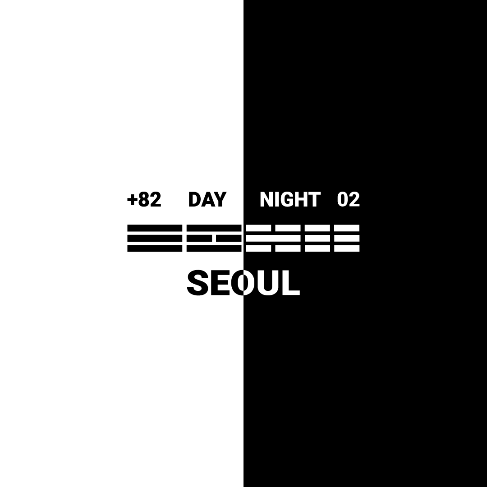
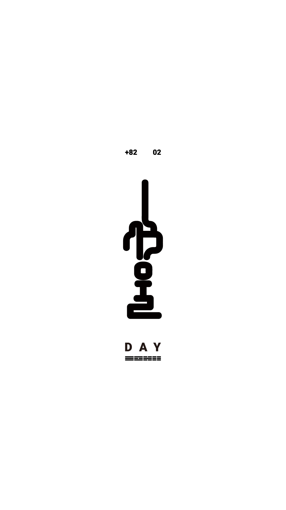
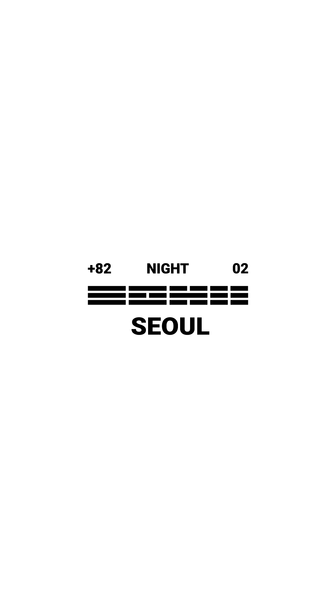
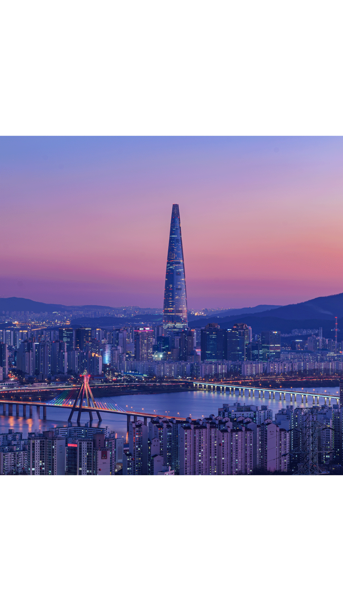
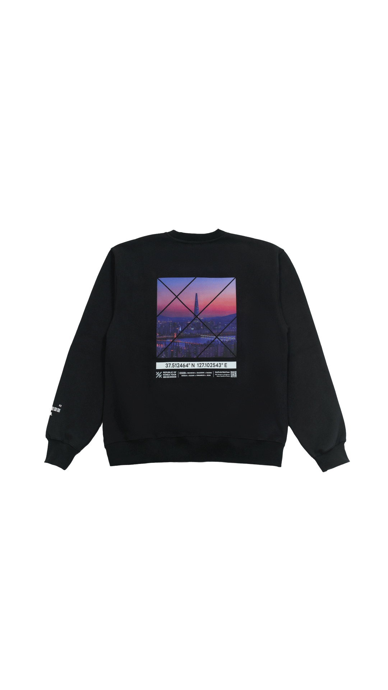
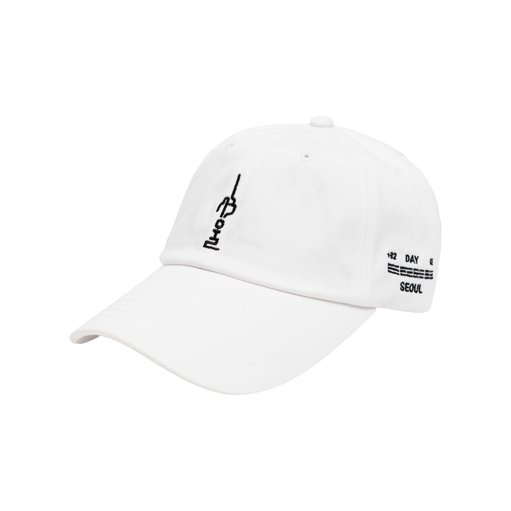
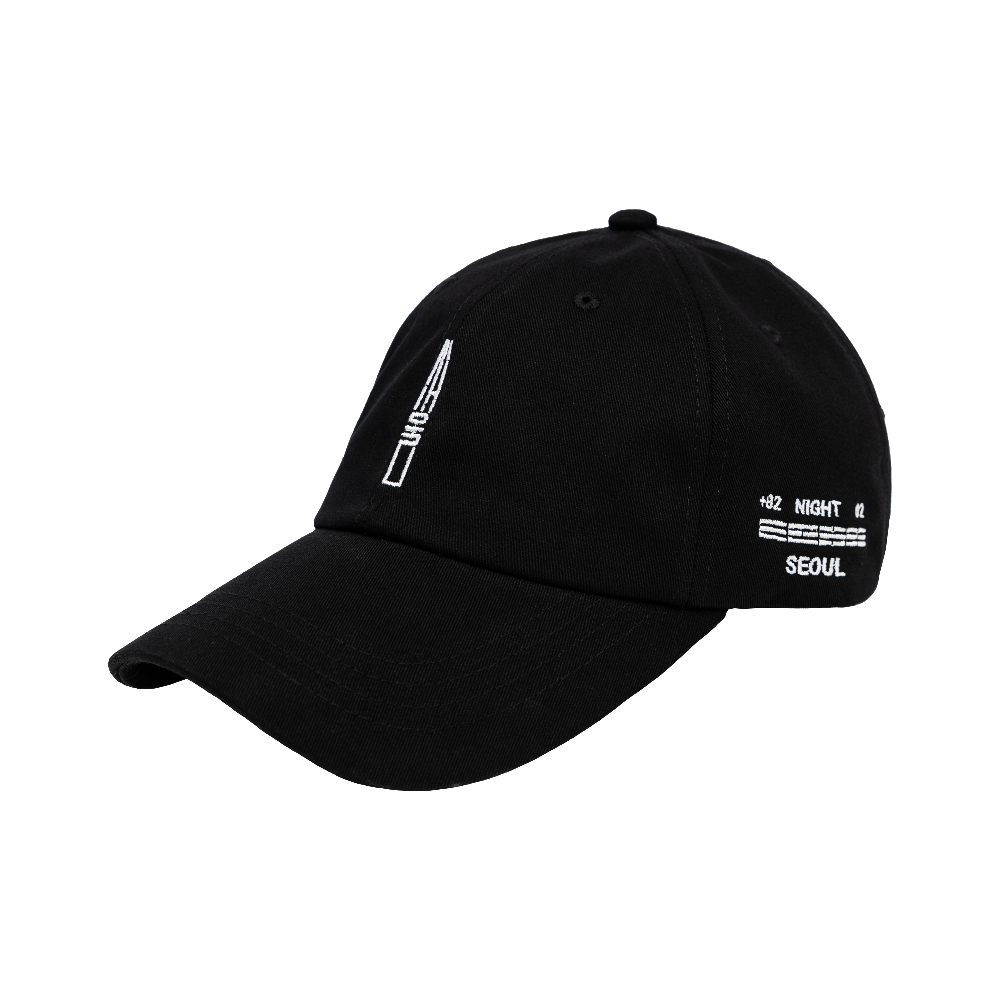
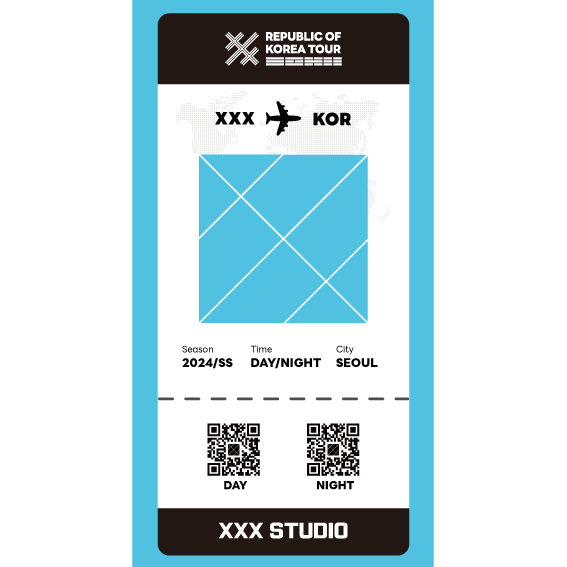
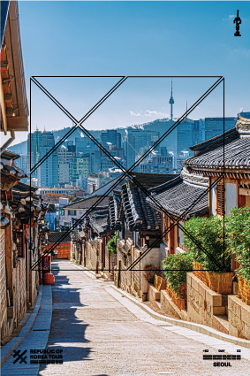

# SELECTED VISUAL REFERENCES

이 폴더의 파일은 Gemini가 브랜드의 실제 시각 언어를 이해하기 위한 최소 참고본이다. PPT에서 그대로 사용하라는 뜻이 아니며, 최종 삽입은 `05_IMAGE_PLACEMENT_PLAN.md`와 로컬 원본을 기준으로 한다.

## Brand / Project

## Chapter Marks

| DAY | NIGHT |
|---|---|
|  |  |

## Actual Seoul Scenes

| DAY — Bukchon | NIGHT — Jamsil |
|---|---|
|  |  |

## Product Proof

| NIGHT Sweatshirt | DAY CAP | NIGHT CAP |
|---|---|---|
|  |  |  |

## Experience Devices

| Ticket | Postcard |
|---|---|
|  |  |

## 사용 제한

- 새로운 제품·로고·패키지 디자인을 이 이미지에서 추정해 만들지 않는다.
- CAP은 현재 물리재고 0이며 사진은 과거 실물/생산 근거다.
- NIGHT Sweatshirt와 2026 판매 SKU의 최종 동일성은 공개 전 다시 확인한다.
- 장면 사진의 최종 상업사용 범위와 크롭은 별도 확인한다.

